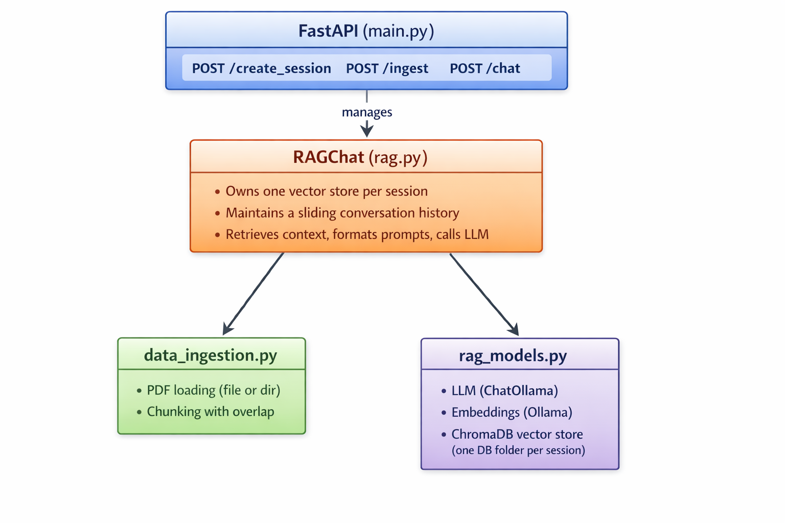
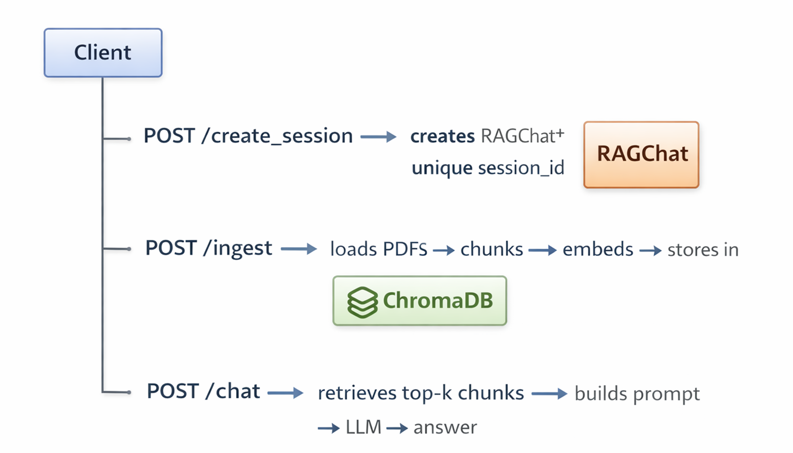

# PDF RAG CHAT API
A session-based Retrieval-Augmented Generation (RAG) API that lets you upload PDF documents and chat with them using a locally-hosted LLM via Ollama. Built with LangChain, ChromaDB, and FastAPI.

---
## Setup instructions
### Prerequisites
Have the following installed:
* Python 3.10+
* Ollama running locally
* Requiered Ollama models
    * llama3.2
    * nomic-embed-text

### Install dependencies
```bash
pip install -r requirements.txt
```
Key packages used:
* `langchain-community`, `langchain-chroma`, `langchain-ollama`, `langchain-google-genai`
* `pdfplumber`
* `chromadb`
* `fastapi`, `uvicorn`
* `python-dotenv`

### Configure enviroment variables
Create a `.env` file in the project root:

```env
# Ollama LLM model name (e.g. llama3, mistral)
LLM_MODEL2=llama3

# Ollama embedding model name (e.g. nomic-embed-text)
OLLAMA_EMBEDDING=nomic-embed-text

# Optional: Gemini (if switching to Google's LLM)
LLM_MODEL=gemini-pro
LLM_API_KEY=your_google_api_key
```

### Run the API
```bash
uvicorn main:app --reload
```
The API will be available at http://127.0.0.1:8000. Interactive docs at http://127.0.0.1:8000/docs.

---
## API usage
API has a 3-step flow: create a session → ingest PDFs → chat.

### Create session
```bash
curl -X POST http://127.0.0.1:8000/create_session
```
Save the `sesion_id`, you'll need it for all subsequent requests.

### Ingest PDFs
Pass the `sesion_id` and PDF file or folder `path`.
```bash
curl -X POST http://127.0.0.1:8000/ingest \
  -H "Content-Type: application/json" \
  -d "{\"session_id\": \"<session_id>\", \"path\": \"<path>\"}"
```
You can call `/ingest` multiple times on the same session to add more documents.

### Chat
Pass the `sesion_id` and `question`.
```bash
curl -X POST http://127.0.0.1:8000/chat \
  -H "Content-Type: application/json" \
  -d "{\"session_id\": \"<session_id>\", \"question\": \"<question>\"}"
```

---
## Architecture

### Implementation architecture
The API is served by FastAPi, it exposes three POST endpoints: `/create_session`, `/ingest` and `/chat`. Each endpoint delegates its work to a `RAGChat` instance, class that orchestrates the RAG pipeline. `RAGChat` pulls functions from two supporting modules:
* `data_ingestion.py`: handles loading and chuncking
* `rag_models.py`: instance the embedding model, LLM and vector store.  
<br>



### Request flow


### Module breakdown

| File | Task |
|---|---|
| `data_ingestion.py` | Loads PDFs (single file or directory) using `PDFPlumber`, splits them into overlapping chunks with `RecursiveCharacterTextSplitter` |
| `rag_models.py` | Instantiates the LLM (`ChatOllama`), embedding model (`OllamaEmbeddings`), and ChromaDB vector store, one isolated store per session |
| `rag.py` | `RAGChat` class, orchestrates retrieval, prompt construction, LLM invocation, and a sliding window conversation memory |
| `main.py` | FastAPI app, exposes three endpoints, manages an in-memory sessions dictionary |

### Key technical decision and trade-offs
**Per-session vector stores**<br>
Each session gets its own ChromaDB collection stored in a dedicated folder (`./embeddings_db_<session_id>`). This guarantees that documents uploaded in one session are never visible in another. <br>

Trade-off: Disk usage grows with the number of sessions. 

**Local LLM**<br>
Both the LLM and the embedding model run locally via Ollama, keeping all data on-premise with no external API calls required. <br>

Trade-off: Performance is hardware-dependent.

**Sliding window conversation memory** <br>
Conversation history is capped at the last 3 exchanges (6 messages). When the limit is reached, the oldest pair is dropped before appending the new one. Keeping the prompt size bounded and avoids hitting the LLM's context window limit.<br>

Trade-off: Older context is lost, which can cause the model to lose track of references from early in a long conversation.

**Strict document-grounded system prompt**<br>
The system prompt explicitly forbids the LLM from using any knowledge outside the retrieved context and mandates exact fallback phrases (`"I don't have enough information..."`) when the context is insufficient.<br>

Trade-off: This makes the assistant very conservative.

**Chunk size and overlap**<br>
Documents are split into chunks of 1024 tokens with an overlap of 128 tokens. The retriever returns the top k = 5 chunks per query.<br>

Trade-off: Large chunks increase the size of the prompt injected into the LLM. 

**In-memory session store**<br>
Sessions are stored in a plain Python dictionary in `main.py`.<br>

Trade-off: This is simple and fast but means all sessions are lost on server restart.

